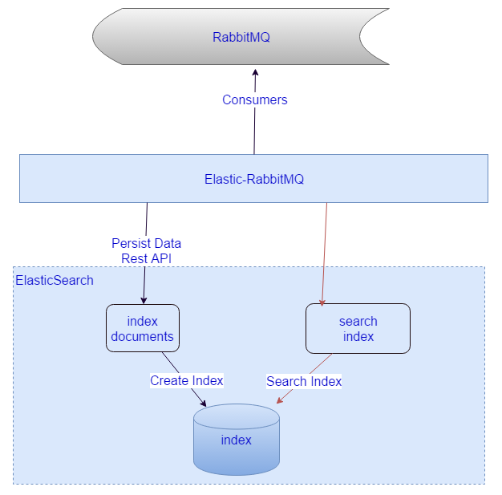

# elastic-rabbitmq
load data into elasticsearch from consume rabbitmq, use version control make data consistent.

# data consume flow

从RabbitMQ中消费message，并persist到ES中。一个明显的问题就是ES没有
事务一致性的保证，通过乐观锁控制每个Document的版本号。在并发写入的情况下这个是一大挑战。

# Some notes
1. [ElasticSearch 深入理解 一：基础概念&源码启动](./notes/basic&sourcestart.md)
2. [ElasticSearch 深入理解 二：乐观锁&版本冲突管理](./notes/optimisticlock&versionconflicthandle.md)
3. [ElasticSearch 深入理解 三：集群部署设计](./notes/cluster_relateddesign.md)
