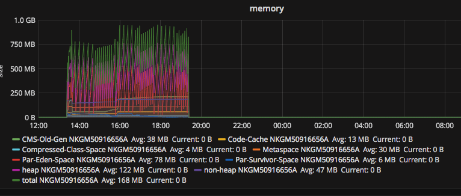
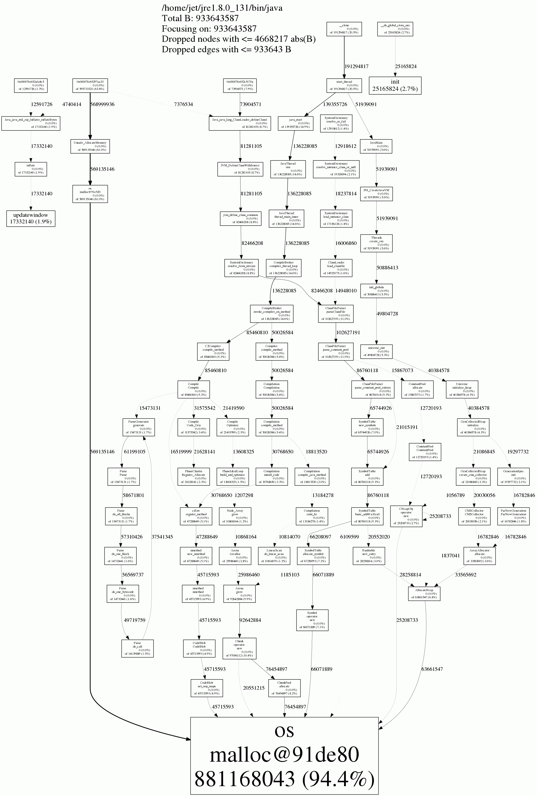

Native memory track use jemalloc for ES
从[这篇文章](https://www.elastic.co/blog/tracking-down-native-memory-leaks-in-elasticsearch)中得知ES在5.1版本中有原生内存泄露的问题，
而碰巧我们生产环境中也在使用5.1系列的版本，但是场景不一样。比如我们并没有使用x-pack，但是还是放心不下，决定在我们的场景下利用文章中的方法进行下测试。

先弄清楚要测试的问题，Java的内存问题，大多数集中在Java Heap上面，所以平时遇到native memory的问题几率较低。Heap是Java新对象创建的地方也是GC工作的
主要区域，平时如果遇到Heap内存问题，通过收集GC日志，基本上就能看出端倪。例如GC时间过长、GC过于频繁的话需要进行GC算法参数的调优，老年代持续增长的话就要看
对象是否分配的合理了，这也是一种泄露-导致GC无法回收。不同的GC算法调优的参数不一样，但目前还是用的CMS，有时间可以总结下。

另外就是native memory的问题，例如出现了Outofmemory的错误：

```
Allocated 1953546736 bytes of native memory before running out
Exception in thread "main" java.lang.OutOfMemoryError: unable to create new native thread
   at java.lang.Thread.start0(Native Method)
   at java.lang.Thread.start(Thread.java:574)
   at com.ibm.jtc.demos.StartingAThreadUnderNativeStarvation.main(
StartingAThreadUnderNativeStarvation.java:22)
```

遇到这样的问题，首先要确定的是是不是由堆内存申请导致的，如果不是就有可能是下面两种：
1. MetaSpace
2. Native memory

只要是JVM相关的内存问题，通过相关的监控工具都能很好的判定，例如如果集成了[Metrics](http://metrics.dropwizard.io/3.2.2/index.html)，可以得到



通过这样的监控可以很容易的可以看出内存问题是否是出自于JVM。

扯得有点远了，回归主题：native memory tracking。
需要清楚的是Native memory tracking是tracking Java进程申请的OS内存，即glibc申请内存的情况。而
[jemalloc](https://github.com/jemalloc/jemalloc)这个工具可以帮助我们抓取到Java进程的内存申请行为。过程也颇为简单：

```
git clone https://github.com/jemalloc/jemalloc
git checkout stable-4
./autogen.sh
./configure --enable-perf
make
sudo make install
```

启动ES之前设置下环境变量：
```
export LD_PRELOAD=/usr/local/lib/libjemalloc.so 
export MALLOC_CONF=prof:true,lg_prof_interval:30,lg_prof_sample:17,prof_final:true
```

环境变量LD_PRELOAD用来替换原生的glibc malloc。
然后启动ES，运行一段时间，停掉后会生成多个jeprof.{processId}的文件，通过下面命令生成内存tracking信息：

```
jeprof --show_bytes --gif ~/jre/bin/java jeprof*.heap > ./app-profiling.gif
```


有将近95%的内存来自于jvm本身，也由于运行时间不是很长，所以可以认为是安全的，如果再持续一段时间这个百分比降低了，说明有内存泄露的可能。

参考：
1. http://www.evanjones.ca/java-native-leak-bug.html
2. https://gdstechnology.blog.gov.uk/2015/12/11/using-jemalloc-to-get-to-the-bottom-of-a-memory-leak/