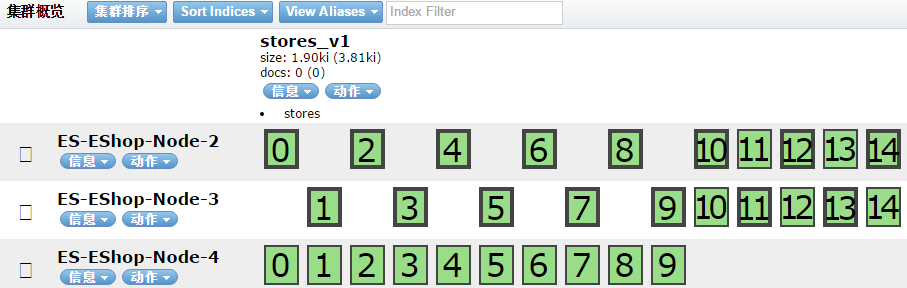
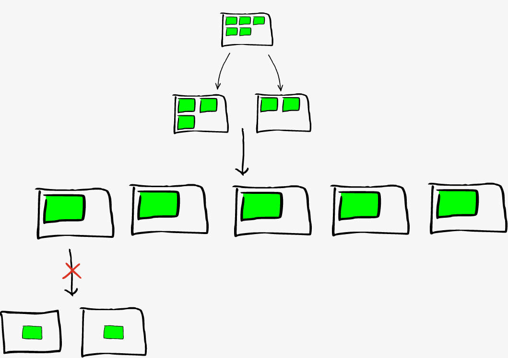
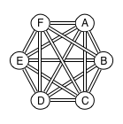
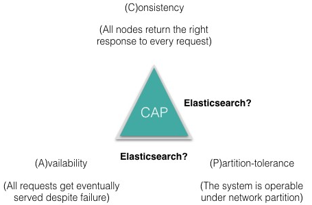

## ElasticSearch 深入理解 三：集群部署设计

ElasticSearch从名字中也可以知道，它的Elastic跟Search是同等重要的，甚至以Elastic为主要导向。
Elastic即可伸缩性，作为一个分布式的搜索引擎，可伸缩性是它的核心竞争力。

### Elastic&Shard

这两个词能放在在一起，因为ES的Elastic是建立在Shard的基础上。Shard作为ES伸缩性的基本单元，可以在不同的node之间迁移。例如我一个实际测试的例子：
两个节点的时候，一个index配置15个shard，1个replica：


每个node都有15个shard，互为备份。
这时再增加一个节点：



ES会做一次rebalancing，这次每个node都平均分了10个shard。但是ES的shard rebalancing有限制，就是shard本身无法split，例如：



一个index有5个shard，scale out到5个node的时候就是每个node一个shard，再增加一个node不会起作用了。当然shard split可以通过重新index，增加shard数量来解决。

每个shard都会有个主分片，副分片的个数由replica确定。对Document产生修改的操作，例如create update delete，都会路由到主分片上，路由的动作由集群中的一个node完成，这个node也称为coordinator。如果使用了ES的java Client用户的request会以round-robin的方式发给集群中的节点，自动实现了负载均衡。

这里有个重要的东西，就是Cluster的一致性，ES通过一个ClusterState结构来确定，ClusterState有一个版本号，在node之间进行同步。支持Diff，用于增量的更新。

### Network Model
在启用一个Cluster之前，需要了解Cluster内部各个node之间的网络连接情况。ElasticSearch集群中的各个node之间的连接是全连接的网络结构：



通过TCP通信，而实际上node之间默认情况下会建立13个TCP连接，分别是：
    
    connectionsPerNodeRecovery = 2
    connectionsPerNodeBulk = 3
    connectionsPerNodeReg = 6
    connectionsPerNodeState = 1
    connectionsPerNodePing = 1

通过定义能够知道大概每个连接的目的是什么了。Ping的那个链接在不同类型node上的行为是不同的，例如如果节点是个master节点ping消息发送的是node fault detection，如果节点是node节点则发送的ping消息是master fault detection。这种类似于心跳消息，通过wireshark抓包可以看到node的ping消息发送还是非常频繁的。当然这个心跳消息发送频率可以通过ping_interval修改，默认是1s。ElasticSearch的集群最好不跨局域网，因为集群的稳定性大大依赖网络的稳定性和效率。

### Split-brain problem
ElasticSearch作为一个分布式的搜索引擎，一大挑战就是集群中的一致性问题。在上篇文章里面说了在高并发下如何通过ES的乐观锁机制保证数据的一致性的，但是主要是从业务场景出发，并没有太多考虑集群中的一致性问题，因为那是ES本身要解决的。

有很多的一致性算法，例如ETCD使用的Raft，从协议层面上保证一致性。ES使用的是自己的一套一致性算法，称为zen discovery。在做一致性同步的同时也会做一些ES本身的数据同步，提高效率，减少带宽。它主要完成以下几个功能：

1. Master节点选举：首先会根据节点的StateVersion，较高的称为master，如果相等，再check node的type，是否能做master，然后进行比较节点的ID，较小的选为master。
2. FaultDetection：master会给所有的node发送node fault detection检测包；普通节点会给master节点发送master fault detection检测包。
3. Membership管理: 节点加入退出等相关处理。
4. Cluster State publish：集群状态的发布，自带版本号用于一致性的状态更新。
5. Unicast Ping：单播Ping包，ES目前已不推荐使用多播做集群发现了，因为不好控制也不安全。单播可以精确控制节点数，使伸缩性变得简单。一个重要的配置项是 ``` discovery.zen.ping.unicast.hosts: ["host1", "host2:port"] ```，指定了ES实例所在的机器。

#### 几个重要配置
对于ElasticSearch如何发生Split-brain，[这篇文章](http://blog.trifork.com/2013/10/24/how-to-avoid-the-split-brain-problem-in-elasticsearch/)清晰地做了解释。
为了防止出现Split-brain问题，ES有几个配置在集群部署时需要格外注意：

    cluster.name: elasticsearch_production //集群的名字，不同名字不能组成一个Cluster
    node.name: elasticsearch_005_data      //该节点的名字
    discovery.zen.minimum_master_nodes: 2  //对防脑裂起到关键作用。需要设置为quorum值，根据node节点的数量：(number of master-eligible nodes / 2) + 1
    
针对recovery有几个配置需要注意：

    gateway.recover_after_nodes: ax //hard limitation，集群正常工作的最少节点数
    gateway.expected_nodes: ex      //集群中总共的节点数，也叫expected
    gateway.recover_after_time: 5m //5分钟后或者ex个节点加入后，开始recovery，看哪个先到

这些配置可以有效防止集群中的数据抖动现象，如果集群一少半存活节点就开始recovery，等后续节点online，还有重新做recovery和shard rebalancing，会浪费大量的CPU、带宽资源，严重可能导致集群短时间无法使用。

ElasticSearch的CAP特性，如下图所示：



任何分布式系统只能满足其中两个，ES满足其中的哪两个呢？好像没有定论，要看自己的实际应用场景了。根据不同的场景选择需要支持哪两种。例如配置minimum_master_nodes为最大数可以保证C，但A就保证不了了。实际生产环境应该都比较倾向于CA，因为P可以人为干预并做好预防。

### Cluster Design
理解了ElasticSearch的Cluster的运作机制，才能更好为业务做出合适的部署方式。例如把ES当成一个底层的主数据存储组件，那就需要高一致性，然后可用性其次；如果ES只是用来做辅助功能例如加速Search，那么高可用性就是首要解决的了。

参考：

1.  https://www.elastic.co/blog/every-shard-deserves-a-home
2.  https://www.elastic.co/blog/writing-your-own-ingest-processor-for-elasticsearch
3.  https://www.elastic.co/blog/found-elasticsearch-networking
4.  https://www.elastic.co/blog/found-keeping-elasticsearch-in-sync
5.  https://www.elastic.co/blog/found-sizing-elasticsearch
6.  https://www.elastic.co/blog/found-elasticsearch-top-down
7.  https://www.elastic.co/blog/found-elasticsearch-from-the-bottom-up#index-segments
8.  https://www.elastic.co/blog/found-crash-elasticsearch#mapping-explosion
9.  https://blog.insightdatascience.com/anatomy-of-an-elasticsearch-cluster-part-i-7ac9a13b05db#.w2skctg2l

