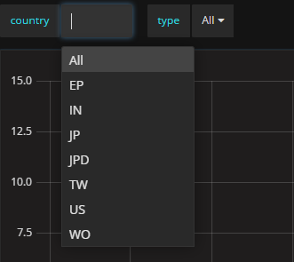
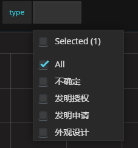
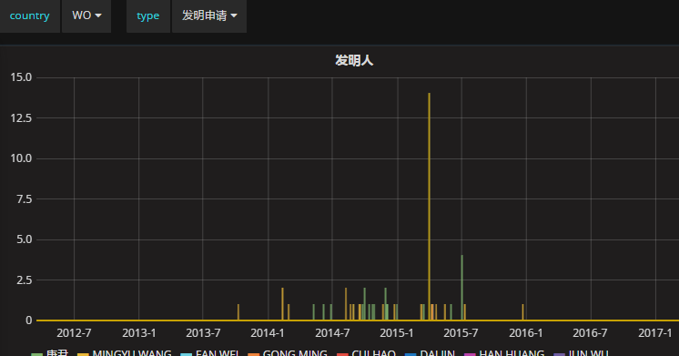

## ElasticSearch data visualization工具：Kibana and Grafana

如果能把数据的实时的可视化，应该是个很好的应用方向。比如目前用的比较多的[ELK](https://www.elastic.co/products)，做日志分析，做系统监控。中间使用Logstash或者Beats把数据收集到ElasticSearch里面，通过Kibana做查询，然后通过配置DashBoard把展示出来。

最近在用Kibana做一些数据的查询优化，发现他的可视化功能还是不错的，但是跟Grafana相比，功能上还是欠缺了些。可视化数据的需求，是方方面面的。大公司的报表，企业做BI、信息化，都离不开数据分析。如果数据能够通过各种维度展现出来，让人更好的理解数据，才能更好的利用数据。所以可视化将会是大数据分析的必然需求。

在研究怎么样更好的去检索ES时，利用了Kibana的Dev Tools并进一步了解到了他的visualize功能。因为之前也使用过Grafana，发现它也支持ES，发现其在可视化ES的数据时更加方便和自由。

### ES数据类型
数据分析跟全文检索不一样，如果字段类型是text的，ES会做分词处理，这种主要用于全文检索。数据分析时，检索的时候可能会看到不想要的结果，所以如果单纯的做可视化，最好将Mapping修改下，将字段类型改为keyword。这个目前只在用Grafana的时候有些问题，Kibana倒是问题不大。

### [Kibana](https://www.elastic.co/products/kibana)
Kibana安装非常方便，官网下载，并配置下ES的URL就可以连上了。Kibana使用的时候会有副作用，它会在你的ES里面创建一个它所需要的Index，并会有较为频繁的query。如果是生产环境，ES存的是核心数据要慎用了。安装好启动指定需要分析的Index，就能看到以下几个Tab。

1. Discover，查询时用的比较多，查询日志信息的时候。可以进行任意的查询，能快速的定位问题。
2. Visualize，提供很多种类型的图展示方式。
3. Dev Tools，提供了很好的跟ES交互的工具，比Postman更方便，感觉可以不用Postman了。
4. Dashboard，Visuallize里面定义的视图可以保存到Dashboard上面，这样可以看到实时分析的结果。

Kibana总体上来讲使用比较傻瓜式的，基本上用鼠标选择下就能用。Dev Tools是个很好的工具HTTP请求写起来很方便，也有历史记录。ES的Search都是Get带body的，在Dev Tools里面很方便使用。

例如：
```
GET _search
{
  "query": {
    "match_all": {}
  }
}
```
鼠标点上GET那一行就能发出去了。手写JSON也毫不费力。

### [Grafana](https://grafana.com/)
印象中Grafana是[InfluxDB](https://www.influxdata.com/)可视化工具，但基于Grafana良好的架构，DataSource可以变得多样性了，现在是支持ElasticSearch作为DataSource的。
Grafana的安装也非常简单，解压启动就可以了。DataSource都是动态添加上去的。Grafana作为一个纯粹的可视化工具，灵活性做到了极致。使用ElasticSearch作为DataSource，指定对应的Index，就可以建立DashBoard就行数据可视化了。相比Kibana，Grafana的template功能能把数据按照任意的维度进行切分展示，这就是它的强大之处。

Grafana需要index有个时间序列的字段，这个其实不难，正常的数据都会有个时间字段的。下面举个例子，有一批专利申请的数据，通过某种手段导入到ES中。例如以专利申请的国家和类型进行切分的话，那就要建立两个模板：
国家的模板，query中填写：
```
{"find": "terms", "field": "国家"}
```
专利类型的模板，query中填写：
```
{"find": "terms", "field": "专利类型"}
```
然后添加panel类型为Graph，以“发明人”字段作为聚合数据。edit panel中的query填写：
```
国家:$country AND 专利类型:$type
```
graph左上角就会有两个选择列表：





例如发明人的panel展示：



可以随意选择维度就行分析。

Grafana还有较为完善的用户管理，这也是强于Kibana的地方。

### Summary
不管是Kibana还是Grafana，都会容易联想到系统监控，日志分析。没错这是它们的强项，不管事序列化的数据还是Metrics Data都能很好的展示出来，让对应的DevOps做监控预警等。从另一方面讲，其他的任何数据，能把数据保存到ES，配合Grafana或者Kibana都能很好的做分析展示。当然更看好Grafana，随着Grafana的功能进一步增强，会变得功能更加强大，图表也会更加多样性。下一步结合Spark或者Hadoop，做个实时的BI也是个不错的方向哦。
