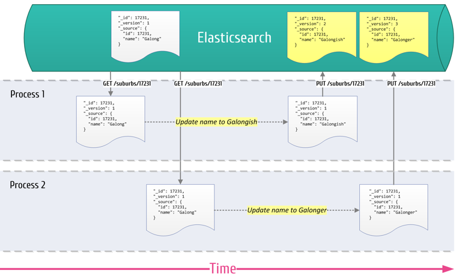
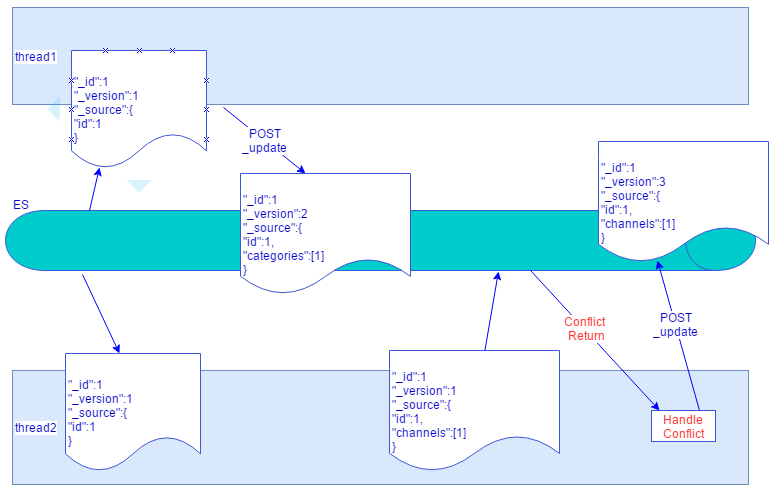
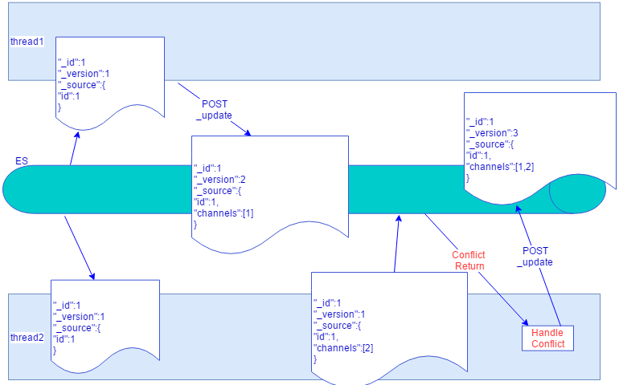

## ElasticSearch 深入理解 二：乐观锁&版本冲突管理

ES用于持久化存储数据时，没有传统数据库的事务一致性保证。因为数据的来源不是单一的，更何况我们的使用场景是通过消费RabbitMQ消息来保存数据。
RabbitMQ作为一个异步消息分发组件，消息的顺序性也是没有保证的，虽然RabbitMQ能保证从生产者接收到的消息和发给消费者的消息顺序保证一致，但是在多个生产者和多个消费者的模式下，消息的顺序是没有保证的。举个一般的例子，一个Business Object的更新操作，很有很多个消息，有更新价格的，有跟新品类名称的等等，这些消息都是没有顺序保证的，有的时候也可能只来了update消息，而create消息还没到来。作为消费者，肯定是并发消费队列消息的，这样并发更新过程中就难以避免版本冲突了。

### ES版本号
ES中的每个Document都会有一个内部版本号，这个版本号是Document的元数据，由ES管理的，可以通过Get拿到Document的版本号。Search默认不返回Document的版本号，可以通过添加个参数到Search Body让ES返回版本号：
```
{
	"version":true
}
```
版本号是从1开始递增的，但是partial update接口不一定会递增版本号，如果数据没有发送更新的话。
版本号更新是atomic的。

### ES乐观锁
ES的乐观锁建立在ES版本号的管理机制之上。乐观锁对应的就是悲观锁。SQL数据库例如MariaDB在。。。隔离模式下都是使用悲观锁，在对某一条记录进行更新的时候，就要先加锁再更新，因为对冲突持有悲观态度所以都提前加锁。
乐观锁不一样，suppose对某个数据的处理不会冲突，也不会加锁，通过API指定更新的版本号，如果版本号不符合就返回exception。

#### Overwrite问题
如果不指定对应的版本号，就会存在overwrite的问题，导致数据丢失。因为ES通过API index数据，遵循Last write win：


如上图所示，两个process同时对一个Document进行name更新，process1的更新就丢失了。这是ES的机制问题，需要应用层小心对待。

### Conflict Handle
Overwrite问题需要解决，特别把ES当作一个存储层来用，数据的一致性非常重要，是不能被Overwrite的。根据消费RabbitMQ的应用场景会存在聚合的场景，即多个不同类型的message，即routing key不同，需要aggregate到一个Document的情况，以Product作为主的Business Object为例。

Conflict是ES的版本号管理机制，但其不管心哪个字段产生了Conflict，有的时候是相同的字段，有的时候是不同的字段，如果能统一去handle Conflict就好了。解决办法是有的，在应用层代码提供handle Conflict的能力。
当然Conflict产生需要有个前提条件，就是要指定更新Document的版本号，如果不指定就会直接被Overwrite了，也不会报409 Conflict的错误。指定版本号很简单，只需要在API URL拼接一个version参数：**version=XX**，这个version就是这次API操作的Document的版本号，如果不是ES就会返回409 Conflict。
不同字段：



两个线程同时对一个product更新，一个更新的是category信息，另一个更新channel信息，由此产生了Conflict。

相同字段：



两个线程同时对product上的channel进行更新，经过Conflict handle后正确写入。

### Consistent Base On Async Event Message
所以说最关键的就是这个问题，保证数据的consistent，而且是在异步高并发消息处理过程中。根据业务流程，不同类型的消息由不同的handler处理，每个handler要实现自己的Conflict Handler方法。

例如一般化的Conflict Handler处理：
```
    protected BiFunction<JsonObject, JsonObject, JsonObject> conflictFunction() {
        return (JsonObject currentObj, JsonObject newObj) -> {
            if (currentObj.get("version").getAsLong() > newObj.get("version").getAsLong()) {
                return currentObj;
            } else {
                return newObj;
            }
        };
    }
```

代码里面适用的是这些BO对象本身也有版本号。

带后Conflict Handle的ES update 流程：
```
try {
            //In case the arguments pollute
            HashMap<String, String> localParam = new HashMap<>();
            if (param != null) {
                localParam.putAll(param);
            }
            if (localParam.get("version") != null && localParam.get("version").equals("-1")) {
                localParam.remove("version");
                return createSource(index, type, sourceId, localParam, newObj);
            } else if (localParam.get("version") != null) {
                logger.debug("do update with version" + localParam + " source=" + newObj.toString());
                return updateOnInsert(index, type, sourceId, localParam, newObj);
            } else {
                ESGetByIdResponse esResponse = documentService.loadSourceById(index, type, sourceId, localParam);
                if (esResponse == null || esResponse.getFound() == false) {
                    return createSource(index, type, sourceId, localParam, newObj);
                } else {
                    logger.debug("Retrieval source " + esResponse.toString());
                    localParam.put("version", esResponse.getVersion().toString());
                    return updateOnInsert(index, type, sourceId, localParam, newObj);
                }
            }
        } catch (ElasticVersionConflictException e) {
            try {
                successful = Status.CONFILICT;
                //conflict
                //In case the arguments pollute
                HashMap<String, String> localParam = new HashMap<>();
                if (param != null) {
                    localParam.putAll(param);
                }
                logger.warn("Conflict happen! type = " + type + " sourceId = " + sourceId);
                TimeUnit.MICROSECONDS.sleep(300);

                //need retrieve new version
                localParam.remove("version");
                ESGetByIdResponse esResponse = documentService.loadSourceById(index, type, sourceId, localParam);
                if (esResponse == null) {
                    logger.error("impossible is happen! need check data " + " type:" + type + " id" + sourceId);
                    throw new IllegalStateException();
                }

                JsonObject changedObj = f.apply(esResponse.getObject(), newObj);
                localParam.put("version", esResponse.getVersion().toString());
                return updateOnInsert(index, type, sourceId, localParam, changedObj);
```

如果BO是首次创建，就是Create的流程：parameter里面要添加参数**params.put("op_type", "create")**，如果不是就走updateOnInsert流程，updateOnInsert就是调用ES的partial update API并如果不存在的情况下就插入新的。

上述的代码也有一个缺陷，例如级联Conflict的情况。就是这次Conflict了，Conflict处理后，又产生了Conflict，这种情况可以多次catch，也可以做记录到另一个数据表中，后面统一进行恢复处理。

参考文档：
1. https://www.elastic.co/blog/elasticsearch-versioning-support